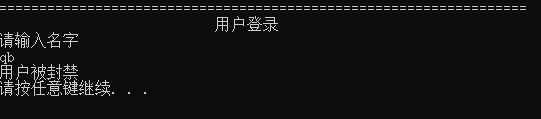

# 商品竞拍平台 用户手册

201220058 王珊

### 登录界面

## 1.管理员系统

### 1.0 登录

按3 管理员登录
本系统规模较小，故仅设一个管理员
名字admin 密码123456

输入错误有更改机会 直到输对为止（以下登录皆是如此）
登录成功 显示管理界面

### 1.1 查看所有商品

将输出所有商品（包括已下架，销售中，已售出的所有商品）的ID，名称，价格，上架时间，卖家ID和
状态。

### 1.2 搜索商品

模糊搜索
将输出所有状态（包括已下架，销售中，已售出的所有商品）的所有和搜索项相关的商品

搜索失败

### 1.3 下架商品

输入ID
若不存在则提示"商品不存在"返回；若已删除，则提示“不可重复删除”并返回；若已下架，则提示“不下
架售出的商品”并返回；

下架成功

不可重复下架或者下架拍卖结束的商品

### 1.4 查看订单

系统会输出所有用户（包括注销的）的订单记录。包括订单的ID，商品ID，卖家ID，买家ID，交易金额
及交易时间。

### 1.5 查看用户

### 1.6 删除用户

输入ID
若不存在则提示"用户不存在"返回；若已删除，则提示“不可重复删除”并返回；

删除用户的同时，其发布的所有商品都会下架。

封禁用户无法登录

### 1.7 注销

退出管理员系统

## 2.  用户系统

###   2.0 登录注册

注册

登录

输入用户名 不存在则退出

成功，进入用户系统

###   2.1 卖家系统

  

#### 2.11 发布商品

####   2.12 查看发布商品

  只能看自己发布的

  

#### 2.13 修改商品

  输入id查询
  若不存在则提示"商品不存在"返回；若已售出，则提示“商品已售出”并返回；若已下架，则提示“商品已
  下架”并返回；

  

#### 2.14 下架商品

  输入id查询
  若不存在则提示"商品不存在"返回；若已售出，则提示“商品已售出”并返回；若已下架，则提示“商品已
  下架”并返回；
  若不为自己商品则提示"您只能下架自己的商品"

####   

#### 2.15 查看历史订单

  可查看卖出订单

###   2.2 买家系统

####   2.21 查看商品列表

可以查看所有商品（现实中的购物软件也是这样的啊）

#### 2.22 竞拍

可以竞拍 在售的商品

不可竞拍 自己的商品

当出价大于低价，且用户买得起的时候，竞拍成功

系统使用过程中，若商品竞拍时间结束，将在后台进行结算、生成订单、并且打印提示。

#### 2.23 搜索

  模糊搜索 
  只输出销售中的所有和搜索项相关的商品
  搜索不到会返回上一级

####   2.24 查看订单

  将您买的所有商品订单信息，订单ID，买家ID，商品ID，商品名称，价格，交易时间。

  

### 2.3 个人信息管理

#### 2.31 查看信息

将打印个人信息

#### 2.32 修改信息

需要输入密码

#### 2.33 充值

已考虑边界值，不可充负数等非法输入

需要输入密码

多次输入错误  用户将被封禁

